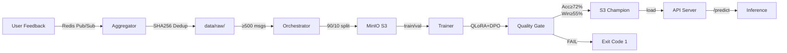

# DPO Continuous Learning Pipeline

Feedback-driven LLM alignment system. Collects preference data, trains LoRA adapters via DPO, validates quality gates, and deploys models.

## How It Works

1. Feedback collection via Redis pub/sub
2. Nightly aggregation with deduplication
3. Training on real Anthropic/hh-rlhf dataset using QLoRA + DPO
4. Quality validation (hard gates, no bypass)
5. Model serving via FastAPI with automatic reloading

---

## Architecture



## Core Components

- **Aggregator** ([src/core/aggregator.py](src/core/aggregator.py)): Redis pub/sub consumer, SHA256 deduplication (24hr TTL), writes to daily JSONL
- **Orchestrator** ([scripts/run_pipeline.py](scripts/run_pipeline.py)): Reads raw feedback, splits train/val, uploads to S3, submits training, runs quality gate, deploys
- **Trainer** ([src/core/trainer.py](src/core/trainer.py)): QLoRA (rank=16, alpha=32) + DPO on Llama-2-7B, real metrics from model outputs
- **Quality Gate** ([src/core/quality_gate.py](src/core/quality_gate.py)): Validation on held-out examples, hard stop if metrics fail
- **API** ([src/api/app.py](src/api/app.py)): FastAPI inference server, loads champion model, auto-reloads on updates
- **Storage** ([src/infra/s3_client.py](src/infra/s3_client.py)): MinIO (local) or AWS S3, dual support

For detailed design, see [docs/DESIGN.md](docs/DESIGN.md).

## Stack

- Redis: Pub/sub + deduplication
- MinIO/S3: Training data + model artifacts
- Transformers + PEFT + TRL: DPO training
- FastAPI: Inference server
- Docker Compose: Local development infrastructure

## Structure

```
src/
├── core/
│   ├── aggregator.py       # Redis consumer + dedup
│   ├── trainer.py          # DPO training (QLoRA)
│   └── quality_gate.py     # Validation gates
├── api/
│   ├── app.py              # FastAPI server
│   └── routes/
│       └── feedback.py     # Feedback endpoint
├── infra/
│   ├── s3_client.py        # MinIO/AWS S3
│   ├── runpod_client.py    # GPU training (optional)
│   └── logging_config.py   # Structured logs
└── models/
    ├── schemas.py          # Pydantic models
    └── config.py           # Config classes

scripts/
├── run_pipeline.py         # Orchestrator (end-to-end)
└── test_feedback.py        # Redis producer (testing)

tests/                       # Integration + unit tests

docker-compose.yml          # Redis, MinIO, Kafka infrastructure
.env                        # Local config (not in git)
```

## Setup

```bash
git clone <repo>
cd DPO
python -m venv venv && source venv/bin/activate
pip install -r requirements.txt
cp example.env .env
```

Start infrastructure:
```bash
docker-compose up -d  # Redis, MinIO, Kafka
```

## Usage

Run aggregator (collects feedback):
```bash
python -m src.core.aggregator
```

Run orchestrator (end-to-end training):
```bash
python scripts/run_pipeline.py
```

Start API server:
```bash
python -m src.api.app
# http://localhost:8000/health
# POST /predict for inference
```

Test with feedback producer:
```bash
python scripts/test_feedback.py
```

## Endpoints

- `/health` - model status + adapter path
- `/predict` - inference with loaded adapter
- `/feedback` - submit preference data (triggers aggregator)

## Quality Gate

Hard validation after training completes:
- Accuracy > 72% (reward model)
- Win-rate > 55% (challenger vs. champion)
- No bypass flag. Failed gate halts pipeline.

## Common Issues

Redis down: Aggregator uses disk-based dedup until reconnect.
Training OOM: Reduce batch size or LoRA rank, resume from checkpoint.
Quality gate fails: Exit code 1, pipeline halts. Manual investigation needed.

See [docs/DESIGN.md](docs/DESIGN.md) for detailed failure modes and recovery.

